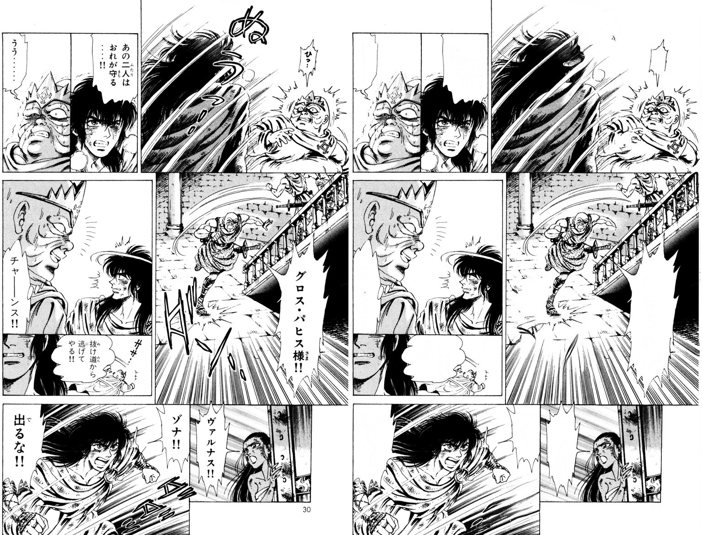
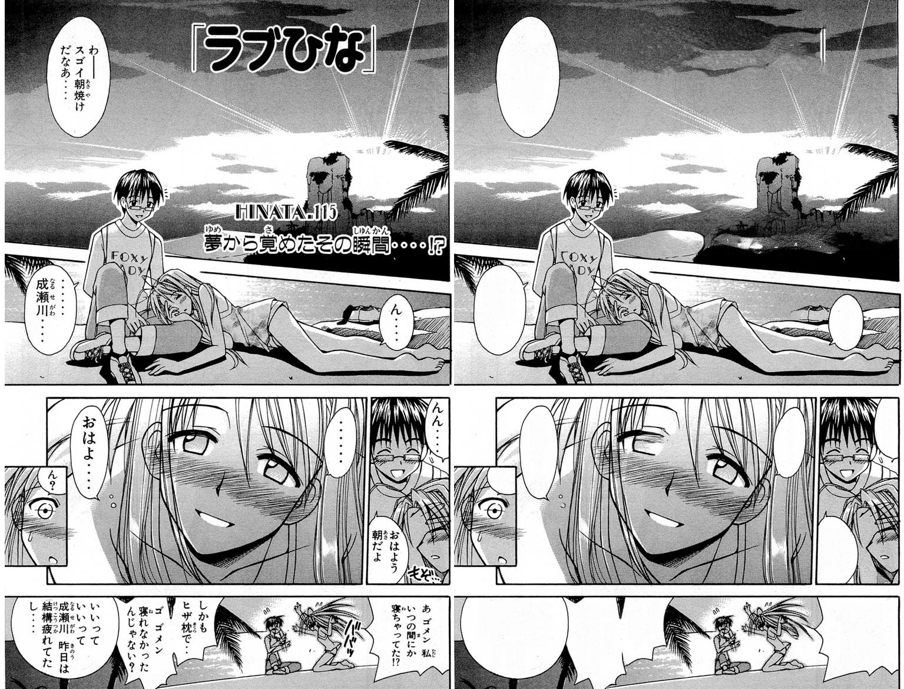
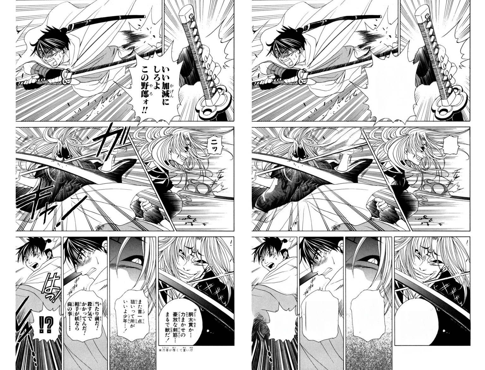
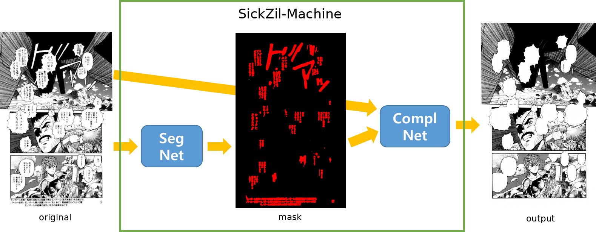

SickZil-Machine
===============
English | [한국어](README.ko_kr.md)

|         | CPU Build | GPU Build |
|---------|-----------|-----------|
| Linux   |    |           |
| Windows |  |           |

(source: [manga109](http://www.manga109.org), © Kanno Hiroshi, © Okuda Momoko, © Kato Masaki)

SickZil-Machine **automates texts removal** during manga/comics translation(Scanlation) process.
  
  

All of the above images were edited automatically without human intervention.\
(source: [manga109](http://www.manga109.org), © Shimazaki Yuzuru, © Akamatsu Ken, © Kobayashi Yuki)

How it works??
-----
### Model

SickZil-Machine finds out the texts in manga/comics and erases it naturally to match the background.\
**Both processes are completely automatic**, without any additional human intervention.\
Of course, if you want, you can also specify text area you want to erase.

By the way, SickZil is korean word 식질, slang of 식자(작업).
식자 means editing manga/comics according to the translation(from translator).

We applied [U-net](https://arxiv.org/abs/1505.04597) for SegNet and [Deepfill v2](http://jiahuiyu.com/deepfill2/) for ComplNet.

### Data set
SickZil-Machine consists of two deep learning models, SegNet and ComplNet.

To learn **SegNet**, we need **original manga images** and \
**text component masks** that cover all text area corresponding to the original images.

To learn **ComplNet**, we need **manga images with text removed** (ie **output**). \
(I'm researching how an images with a small amount of text affects performance. \
 manga images with no text at all are the ideal data.) 

Version 0.1.1 was trained using 285 image-mask pairs and 31,497 manga images. \
(11,464 of 31,497 manga images are images with text.)

If you'd like to contribute a dataset to SickZil-Machine, please send your data to <a href="mailto:kur.creative.org@gmail.com"> email </a>. \
The dataset will only be used for research purposes.

Release
-----
**We released 0.1.1 pre-release version!** \
[You can download SZMC here](https://github.com/KUR-creative/SickZil-Machine/releases). \
[Tutorials and Tips here.](https://github.com/KUR-creative/SickZil-Machine/blob/master/doc/tips/tips-0.1.1-eng.md)

SickZil-Machine is not a perfect program. We need your help. \
If you find a bug or have a suggestion, please open a [Github issue](https://github.com/KUR-creative/SickZil-Machine/issues) or send us an <a href="mailto:kur.creative.org@gmail.com">email</a>.

Run the code(for developers)
----

You need NVIDIA driver 410.x, CUDA 10.0, CUDNN (>= 7.4.1). (tensorflow 1.13.0 requirements)

0. `git clone https://github.com/KUR-creative/SickZil-Machine.git; cd SickZil-Machine`
1. Download one of release zip files from [here](https://github.com/KUR-creative/SickZil-Machine/releases).
2. Unzip the release file and copy `SickZil-Machine-0.1.1-pre0-win64-cpu-eng/resource/cnet` and `SickZil-Machine-0.1.1-pre0-win64-cpu-eng/resource/snet` directories to `SickZil-Machine/resource`.
3. `pip install -r requirements.txt`
4. `cd src; python main.py`

Future works
-----
- Increase text segmentation performance
- Open manga text segmentation mask dataset
- Automate typesetting(calligraphy style learning)

 
 
 
