Install
----

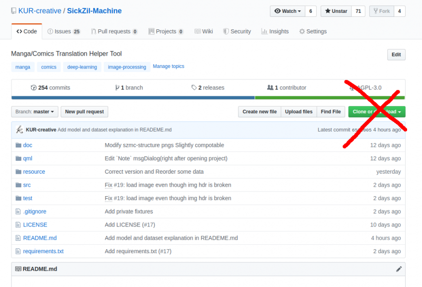

Not this

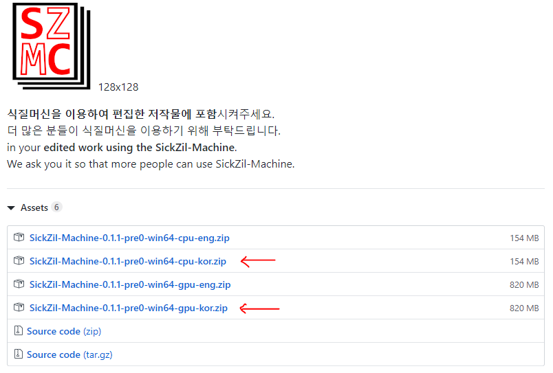

https://github.com/KUR-creative/SickZil-Machine/releases \
Download SZMC here. \
If you look down at the bottom of release page, there are *assets* like above.

If your gpu's performance isn't good enough or you have AMD gpu, get win64-cpu-enu.zip. \
 Are you angry that SZMC doesn't support AMD...? That's not our fault, but TensorFlow. \
Go to Google's office and lay down 

Execution
----

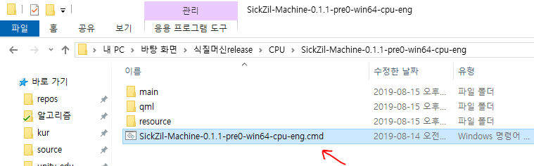

Double click `SickZil-Machine-0.1.1-pre0-win64-gpu-eng.cmd` or

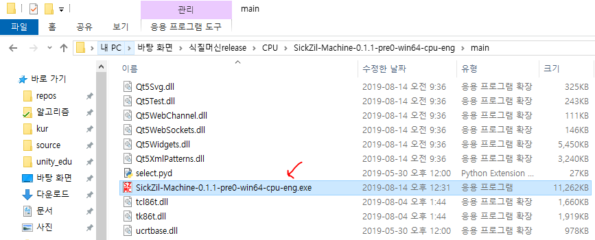

Double click the `SickZil-Machine-0.1.1-pre0-win64-gpu-eng.exe` file in the `main` folder to run SZMC.

Create manga project folder
----

SZMC always work with "**Manga Project Folder**". \
The manga project folder is a folder that contains four folders: **images, masks, prev_images, prev_masks**.

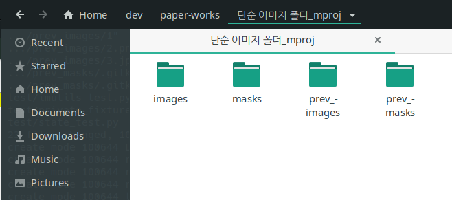

**images** stores all of the images you edit on SZMC. \
When you remove all texts using SZMC, then insert translated texts to manga images in the `images` folder.

**masks** stores the masks you create. **You can edit this mask with an external program**! \
If you edit the mask externally, open a new manga project folder, or view another image and return to image, the edited mask is loaded.

**prev_images** stores **original images**. SZMC does not edit this images. \
Used when restoring an image (the rightmost tool in the toolbar), and when you put text later, you can use it conveniently in program like Photoshop.

prev_masks has no features yet and is always empty.

If you open a folder other than the manga project folder, \
If there is at least one image in a folder (this is called a "flat image folder") \
Then you can create a **new manga project folder**.

Click [Open] - [Open Manga Project Folder].

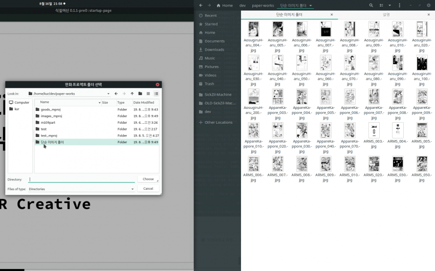

If you press `choose` button, you will be asked to create a manga project folder.

then

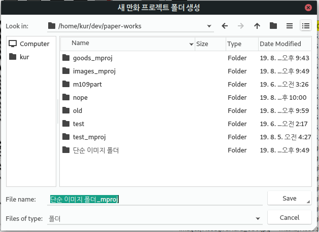

 

By default, the name of the output folder is `input folder name` + \_mproj. \
Press Save to create new manga project folder.

And then images are copied.

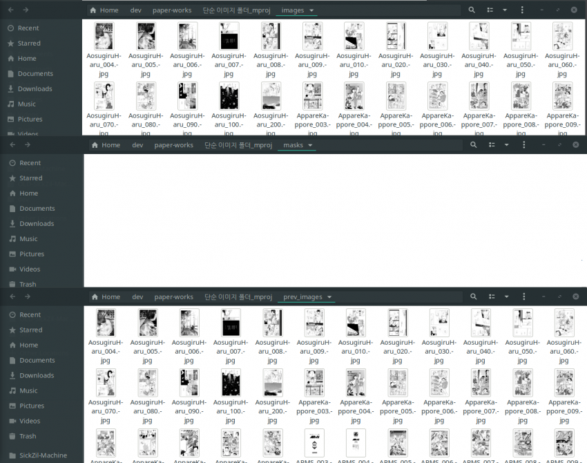

`masks` is still empty. When you create a masks with SZMC, masks are stored in `masks` and can be edited with an external program.

In the future, you can then open(or load) manga project folder you created.

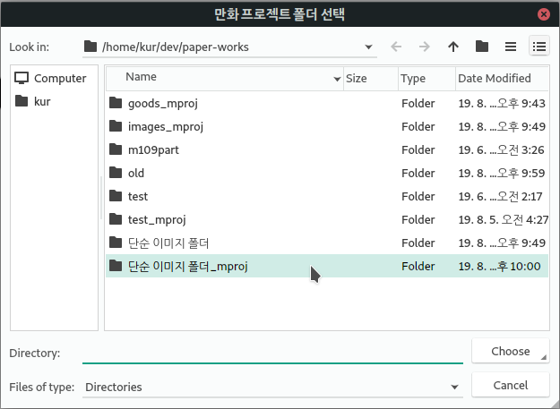

 

Edit images and masks with external tools
----

This is most important tip for experienced users.
To be honest, the GUI has no zoom in/out and no fill tool. It sucks. \
So I made a project as an ordinary folder. To use external tools.

1) Create a manga project folder on SZMC.
2) Press the Batch Mask Generation button (GenMaskAll: the first button on the left).
3) When every masks are created, shut down SZMC.
4) Edit all masks properly using a program like Photoshop.
5) Turn on SZMC again and open the edited manga project folder.
6) Press the text-delete-all button (rmTxtAll: second button from left in tool bar).

If a manga image is too large, the current gui that can't zoom in/out can be very inconvenient. \
Use this method if you find it difficult to use the built-in tools.

Dataset Contribution
----

In fact, the cumbersome work of 4. is because the accuracy of SZMC is not good enough. \
If you provide data to us, SZMC can learn more and diverse images.

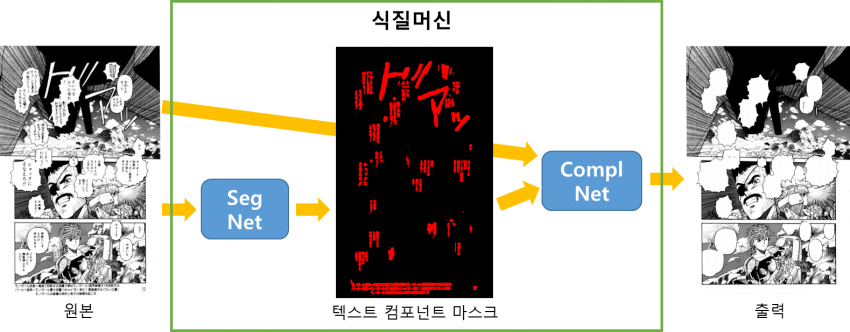

There are 3 (+1) pieces of data needed for SZMC.
1) Original manga image (**original**)
2) A mask that accurately covers the text of the original manga image (**Text component mask**)
3) Manga image with text and sound effects erased (**output**)  (Note-This is not an image with translated text.) </ Sub>
4) Manga image filled with translated text properly by completing translation (not shown above)

These images can be easily created using a SZMC. \
(Of course, even if the image is made by hand, if these satisfy the above format, images can be used to learn SZMC.) \
Provided data will be used for research purposes only and SZMC will be learn periodically from the data to improve accuracy. \
(Currently, SZMC has been learned about 300 images for SegNet and 30,000 images for ComplNet. Not enough.)

<a href="mailto:kur.creative.org@gmail.com"> kur.creative.org@gmail.com </a>

I would appreciate it if you could send me the data above.

Other Fancy Tips
----
- You can view previous/next image using the up/down arrow keys.
- Click and drag the mouse wheel to move canvas.
- The rightmost Revert button (RvertImage) only reverses one image.
   If you want to revert all the images, copy the images from prev_images and overwrite them.
- If the image is too big for mask editing, you can also use an external program.

Finally..
----
There's no manual in the program, so someone seems to be a little confusing. \
We will post a tutorial on YouTube including the above tips.

And we request: \
Please insert next watermark

and git repository URL

https://github.com/KUR-creative/SickZil-Machine

to works edited with SZMC \
It's for promotional purposes. (You can put shrinked watermark)

But some people said that the watermark was bad.

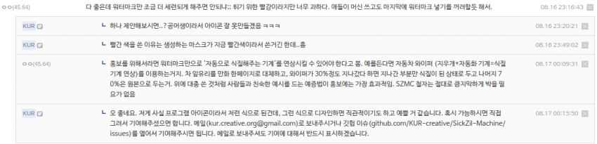
 

Well.. we admit it.

Draw a nicer, more intuitive icon and send me an email at <a href="mailto:kur.creative.org@gmail.com"> kur.creative.org@gmail.com </a> or \
Please upload it to [Github Issues](https://github.com/KUR-creative/SickZil-Machine/issues). \
If there are a lot of candidates, We need vote later?

Thank you for reading this long article.
